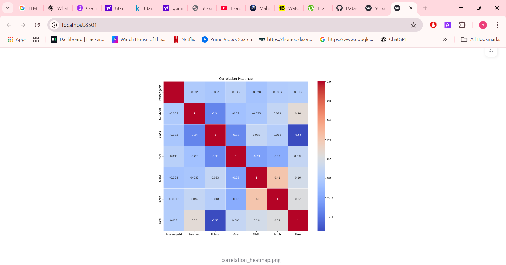
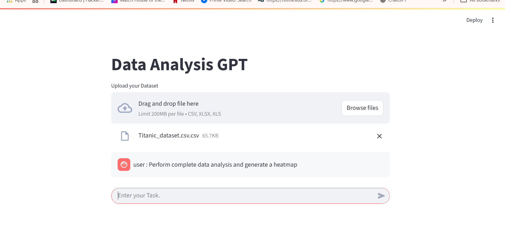

# 📊 Data Analyzer Agent using Autogen Framework

This project demonstrates how to build a **Data Analyzer Agent** using the **Autogen framework**. The agent can analyze CSV/Excel datasets, perform statistical analysis, generate code and insights, and answer natural language questions about the data. It can also integrate with a **Streamlit UI** for interactive data exploration.

---

## ✅ Features
- Load and analyze **CSV/Excel** files.
- Perform **data cleaning, summarization, and visualization**.
- Answer **natural language questions** using LLM.
- Optional **Streamlit UI** for interactive analysis.
- Extendable for **custom domain-specific analytics**.

---

## ✅ Tech Stack
- **Python 3.10+**
- **[Autogen Framework](https://microsoft.github.io/autogen/)**
- **Pandas** for data processing.
- **OpenAI API or Local LLM** for natural language queries.
- **Streamlit** (optional) for web UI.
- **Docker** for running the docker container.

---

## ✅ Project Structure
```
data-analyzer-agent/
│
├── Config/
│ ├── Constants.py #Constants for Docker settings.
│ ├── Docker_utils.py #loading Docker settings
│ ├── openai_model_client.py  # Load the Gemini model
├── Agents/
│ ├── Data_Analyser_agent.py # Main data analysis agent logic
│ ├── CodeExecutor_agent.py
├── Teams/
│ └── AnalysisGptTeam.py
├── temp/
│ └── data.csv # Example dataset to load
├── Titanic_dataset.csv # Example Dataset.
├── main.py
├── streamlit_app.py # Streamlit UI (optional)
├── .env  # storing the api keys
├── requirements.txt # Project dependencies
└── README.md # Project documentation
<<<<<<< HEAD
```

=======

```
>>>>>>> 23d1d3db1d5143e2b06293247dec2f0fa2d28890
Create the .env file and store the gemini_api_key with variable as: "GEMINI_KEY"


---

## ✅ Installation

### **1. Clone the repository**
```bash
git clone https://github.com/Ravitej12321/Data-Analyser-Agent.git
cd data-analyzer-agent
```
uv  venv .venv
source .venv/bin/activate   # (Linux/Mac)
.venv\Scripts\activate      # (Windows)

## installing the requirements.

uv add -r requirements.txt

## Run the team using UI.
python streamlit run streamlit_app.py

Features in UI:

* Upload CSV/Excel file.

* Auto-display data table.

* Generate summaries and charts.

* Ask natural language questions.
## Screenshots
Generated Heatmap using the dataset


User Input Image


## Example Queries:
1. "Can you tell me how many rows are there  in the dataset"
2. "Can you draw a graph for people lived vs died from my dataset in the directory and save it as Output.png"
3. "Perform complete data analysis and give me the useful insights and store all the graphs analysis output_images_with timestamp in analysis folder"

---

✅ Future Enhancements

✅ Multi-agent collaboration for advanced analytics.

✅ Real-time data processing.

✅ LangChain + VectorDB integration for large datasets.

✅ Automated chart generation with Plotly.


